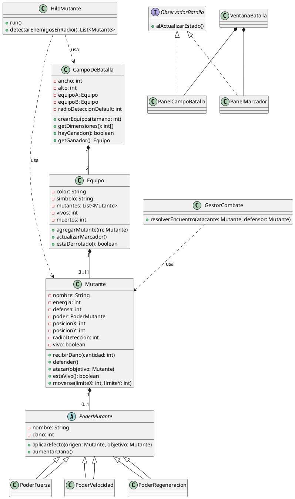

# Juego de Batalla de Mutantes

**Curso:** Programación Orientada a Objetos 
**Instituto Tecnológico de Costa Rica**
**Fecha de entrega final:** viernes 25 de septiembre

---

## 1. Descripción general

El sistema implementa un juego automático de batalla de mutantes. El único
dato que ingresa el usuario es el tamaño de los equipos (un valor entre 3 y
11, igual para ambos). A partir de ahí, el sistema genera mutantes
aleatorios para dos equipos y ejecuta la batalla de forma completamente
automática, sin intervención adicional del usuario, hasta que uno de los
dos equipos pierde a todos sus mutantes.

El proyecto se organiza en cuatro capas con responsabilidades separadas:

| Capa | Paquete | Responsabilidad |
|---|---|---|
| Modelo | `model` | Representar mutantes, poderes, energía y defensa |
| Juego | `game` | Representar el campo de batalla, los equipos y el marcador |
| Control | `control` | Movimiento, detección de enemigos y resolución de combates (concurrente) |
| UI | `ui` | Dibujar el estado del juego en tiempo real (Swing + Observer + MVC) |

---

## 2. Especificación de clases

### 2.1 Capa Modelo (`model`)

**Clase `Mutante`**

| Atributo | Tipo | Descripción |
|---|---|---|
| `nombre` | `String` | Identificador del mutante |
| `energia` | `int` | Energía actual, inicia en `100` |
| `defensa` | `int` | Capacidad de defensa, entre `1` y `3` |
| `poder` | `PoderMutante` | El poder que porta el mutante (a lo sumo uno) |
| `posicionX`, `posicionY` | `int` | Posición actual en el campo |
| `radioDeteccion` | `int` | Radio dentro del cual detecta enemigos |
| `vivo` | `boolean` | Estado de vida |

Métodos principales: `recibirDano(int cantidad)`, `defender()`,
`atacar(Mutante objetivo)`, `estaVivo(): boolean`,
`moverse(int limiteX, int limiteY)`.

**Clase abstracta `PoderMutante`**

| Atributo | Tipo | Descripción |
|---|---|---|
| `nombre` | `String` | Nombre del poder |
| `dano` | `int` | Daño base, entre `1` y `3`, sube hasta un máximo de `7` |

Método abstracto: `aplicarEfecto(Mutante origen, Mutante objetivo)`.

Cada mutante puede portar un poder distinto. Para que esto tenga un uso real
de herencia y polimorfismo (no solo un cambio de nombre), `PoderMutante` es
abstracta y se definen subclases concretas, por ejemplo:

- `PoderFuerza`: aumenta el daño directo de ataque.
- `PoderVelocidad`: puede afectar la frecuencia de movimiento o el radio de
  detección efectivo.
- `PoderRegeneracion`: recupera parte de la energía propia con cada golpe
  exitoso.

Cada subclase sobrescribe `aplicarEfecto(...)` con su propio comportamiento.

---

### 2.2 Capa Juego (`game`)

**Clase `Equipo`**

| Atributo | Tipo | Descripción |
|---|---|---|
| `color` | `String` | Color identificador del equipo |
| `simbolo` | `String` | Escudo o símbolo del equipo |
| `mutantes` | `List<Mutante>` | Mutantes del equipo |
| `vivos`, `muertos` | `int` | Marcador del equipo |

Métodos: `agregarMutante(Mutante m)`, `actualizarMarcador()`,
`estaDerrotado(): boolean`.

**Clase `CampoDeBatalla`**

| Atributo | Tipo | Descripción |
|---|---|---|
| `ancho`, `alto` | `int` | Dimensiones del campo |
| `equipoA`, `equipoB` | `Equipo` | Los dos equipos en juego |
| `radioDeteccionDefault` | `int` | Valor por defecto del radio de detección |

Métodos: `crearEquipos(int tamano)`, `getDimensiones(): int[]`,
`hayGanador(): boolean`, `getGanador(): Equipo`.

---

### 2.3 Capa Control (`control`)

**Clase `HiloMutante`** (implementa `Runnable`)

Responsable de mover un mutante repetidamente y detectar cuándo entra en el
radio de un enemigo. Métodos: `run()`,
`detectarEnemigosEnRadio(): List<Mutante>`.

**Clase `GestorCombate`**

Responsable de aplicar la fórmula de daño y de garantizar que cada
encuentro entre dos mutantes se resuelva una sola vez, incluso si ambos
hilos lo detectan al mismo tiempo. Método principal:
`resolverEncuentro(Mutante atacante, Mutante defensor)`.

---

### 2.4 Capa UI (`ui`)

**Interfaz `ObservadorBatalla`**

Método: `alActualizarEstado()`.

**Clase `VentanaBatalla`** (extiende `JFrame`)
Contenedor principal de la aplicación; incluye el botón de nueva partida.

**Clase `PanelCampoBatalla`** (extiende `JPanel`, implementa `ObservadorBatalla`)
Dibuja el campo y los mutantes vivos, coloreados según su equipo.

**Clase `PanelMarcador`** (extiende `JPanel`, implementa `ObservadorBatalla`)
Muestra energía, vivos/muertos por equipo y anuncia al ganador.

La UI **nunca** calcula lógica de juego: solo consulta el estado del
Modelo y reacciona a las notificaciones (patrón Observer) para repintarse.

---

### 2.5 Constantes (`constants`)

Clase `ConstantesJuego` con, entre otros:

```
ENERGIA_INICIAL      = 100
DEFENSA_MIN          = 1
DEFENSA_MAX          = 3
DANO_MIN             = 1
DANO_MAX             = 3
DANO_MAX_PODER       = 7
TAMANO_EQUIPO_MIN    = 3
TAMANO_EQUIPO_MAX    = 11
RADIO_DETECCION_DEFAULT
REFRESH_RATE_MS
```

---

## 3. Diagrama UML (PlantUML)



*(Pegar aquí también la imagen renderizada del diagrama una vez generada
con la extensión de PlantUML.)*

---

## 4. Decisiones de diseño

Estas son decisiones ya tomadas para el diseño, junto con su justificación:

**4.1 Posición inicial de los mutantes**
Cada mutante nace dentro de una "zona base" asignada a su equipo (por
ejemplo, equipo A en el extremo izquierdo del campo, equipo B en el
extremo derecho), en vez de un spawn completamente aleatorio en todo el
campo. Esto da un punto de partida más realista y evita combates
instantáneos apenas arranca la partida, dependiendo del tamaño que se
defina para cada zona base.

**4.2 Condición de muerte**
Un mutante muere cuando su energía llega a `0`. A partir de ese momento no
puede atacar ni defender, y debe quedar excluido de cualquier detección de
enemigos por parte de otros hilos.

**4.3 Momento en que se decide atacar o defender**
La decisión de atacar o defender **no** es libre ni continua: solo ocurre
quando el movimiento de un mutante lo coloca dentro del radio de detección
de un enemigo (o viceversa). Debe garantizarse que cada par de mutantes
que se cruza genere un único encuentro, incluso si ambos hilos detectan el
cruce al mismo tiempo.

**4.4 Radio de detección**
Por ahora es un valor único, igual para todos los mutantes
(`RADIO_DETECCION_DEFAULT`), pero se implementa como un atributo de
instancia en `Mutante` (no como una constante usada directamente en los
cálculos), de modo que en una futura iteración un poder específico pueda
modificar el radio de un mutante en particular sin tener que rediseñar la
lógica de detección.

**4.5 Poderes distintos por mutante**
`PoderMutante` se define como clase abstracta con subclases concretas
(`PoderFuerza`, `PoderVelocidad`, `PoderRegeneracion`, ...), cada una con su
propia implementación de `aplicarEfecto(...)`, para cumplir con el uso real
de herencia y polimorfismo pedido en el enunciado.

**4.6 Esquema de concurrencia (pendiente de definir)**
Se evalúan dos enfoques para el movimiento paralelo de los mutantes:
- Un `Thread` por mutante: más directo de implementar y de explicar.
- Un `ExecutorService` con un pool de hilos fijo: más eficiente en
  recursos y con apagado más ordenado, pero conceptualmente menos directo.

Se plantea iniciar con un `Thread` por mutante para validar la lógica de
movimiento y combate, y evaluar migrar a `ExecutorService` una vez que esa
lógica esté estable.

---

## 5. Preguntas abiertas para discutir con el profesor

- Tamaño recomendado para la "zona base" de cada equipo.
- Si el número de subclases de `PoderMutante` propuesto (3) es suficiente
  para demostrar el uso de herencia/polimorfismo que pide la rúbrica.
- Validación del enfoque de concurrencia (hilo por mutante vs. pool).
- Mecanismo propuesto para evitar combates duplicados cuando dos mutantes
  se detectan mutuamente en el mismo instante.