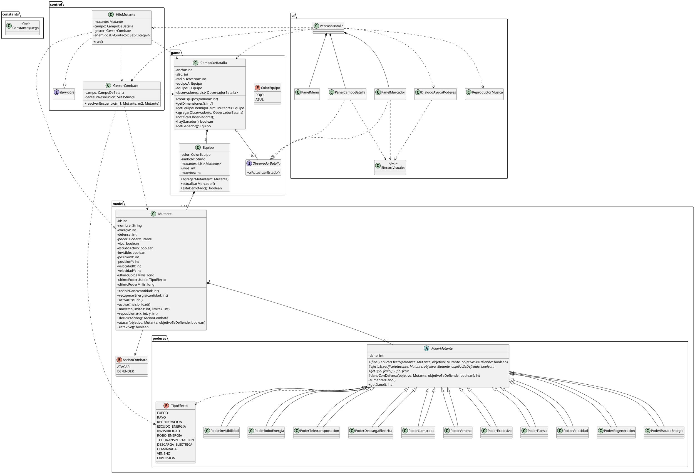

# Juego de Batalla de Mutantes

**Curso:** Programación Orientada a Objetos
**Instituto Tecnológico de Costa Rica**
**Fecha de entrega final:** viernes 25 de septiembre

**Autores:**
Elian Montero,
Patrick Zúñiga

---

## 1. Descripción general

El sistema implementa un juego automático de batalla de mutantes. El único dato que ingresa el usuario es el tamaño de cada equipo (entre 3 y 11, igual para ambos). A partir de ahí, el sistema genera mutantes aleatorios para dos equipos y ejecuta la batalla de forma completamente automática, sin intervención adicional del usuario, hasta que uno de los dos equipos pierde a todos sus mutantes.

El proyecto se organiza en cuatro capas con responsabilidades separadas, cada una en su propio paquete, respetando una regla estricta de dependencias: **una capa nunca depende de la que está por encima de ella**.

* **Constantes** (`constants`): valores fijos del juego, sin dependencias de otras capas.
* **Modelo** (`model`, `model.poderes`): mutantes, poderes, energía, defensa, movimiento. Depende solo de `constants`.
* **Juego** (`game`): campo de batalla, equipos, marcador, patrón Observer (sujeto). Depende de `model` y `constants`.
* **Control** (`control`): movimiento concurrente, detección de encuentros, resolución de combates. Depende de `model`, `game` y `constants`.
* **UI** (`ui`): ventana, dibujo en tiempo real, menú, ayuda, música (Swing + Observer + MVC). Depende de todas las anteriores.

---

## 2. Especificación de clases

### 2.1 Constantes (`constants`)

**Clase `ConstantesJuego`** — clase `final`, con constructor privado (nunca se instancia), reúne todos los valores fijos del juego para evitar números "quemados" en el código:

* `ENERGIA_INICIAL`, `DEFENSA_MIN`, `DEFENSA_MAX`
* `DANO_MIN`, `DANO_MAX`, `DANO_MAX_PODER`
* `TAMANO_EQUIPO` (mínimo), `TAMANO_EQUIPO_MAX`
* `RADIO_DETECCION_DEFAULT`
* `ANCHO_ZONA_BASE`
* `VELOCIDAD_MUTANTE_MIN`, `VELOCIDAD_MUTANTE_MAX`
* `INTERVALO_MOVIMIENTO_MS`
* `CANTIDAD_HILOS_POOL`
* `PROBABILIDAD_CAMBIO_RUMBO`
* `MULTIPLICADOR_LLAMARADA`, `MULTIPLICADOR_EXPLOSIVO`
* `PORCENTAJE_DANO_VENENO`

---

### 2.2 Capa Modelo — `model`

**Clase `Mutante`**

* `- id: int` (identificador único, `final`)
* `- nombre: String` (generado a partir del tipo de poder, `final`)
* `- energia: int` (inicia en `ENERGIA_INICIAL`; protegida con `synchronized`)
* `- defensa: int` (entre `1` y `3`, `final`)
* `- poder: PoderMutante` (a lo sumo uno por mutante, `final`)
* `- vivo: boolean`
* `- escudoActivo: boolean`, `- invisible: boolean` (banderas de un solo uso para poderes específicos)
* `- posicionX: int`, `- posicionY: int` (posición actual en el campo)
* `- velocidadX: int`, `- velocidadY: int` (velocidad fija con dirección aleatoria, cambia ocasionalmente)
* `- ultimoGolpeMillis: long` (`volatile`; marca de tiempo del último golpe recibido, usada por la UI para el efecto visual)
* `- ultimoPoderUsado: TipoEfecto`, `- ultimoPoderMillis: long` (`volatile`; para el efecto visual del poder activado)

*Métodos clave:* `recibirDano(int)`, `recuperarEnergia(int)`, `activarEscudo()`, `activarInvisibilidad()`, `moverse(int limiteX, int limiteY)`, `reposicionar(int, int)`, `decidirAccion(): AccionCombate`, `atacar(Mutante objetivo, boolean objetivoSeDefiende)`, `estaVivo(): boolean`.

**Decisiones de diseño relevantes:**
* Todos los métodos que leen o modifican `energia`, `vivo`, `escudoActivo`, `invisible`, posición o velocidad son `synchronized`, porque varios hilos de la capa `control` pueden acceder al mismo mutante de forma concurrente (por ejemplo, dos enemigos distintos atacándolo casi al mismo tiempo).
* Los campos usados solo para efectos visuales (`ultimoGolpeMillis`, `ultimoPoderUsado`, `ultimoPoderMillis`) son `volatile` en vez de `synchronized`: solo necesitan garantía de visibilidad entre hilos para una asignación simple, no una operación compuesta de lectura-modificación-escritura, así que `volatile` es más liviano y suficiente.
* El movimiento sigue un patrón de "caminata aleatoria con persistencia" (*correlated random walk*): cada mutante mantiene rumbo y velocidad fijos la mayoría del tiempo (con rebote en los bordes del campo), pero tiene una probabilidad baja (`PROBABILIDAD_CAMBIO_RUMBO`) en cada paso de tomar un nuevo rumbo al azar. Esto evita que mutantes con trayectorias sincronizadas queden "atrapados" sin cruzarse nunca, sin perder el requisito de que el movimiento tenga un patrón reconocible.

**Enum `AccionCombate`** (vive en `model`, junto a `Mutante`, porque representa una decisión propia del mutante):
* `ATACAR`
* `DEFENDER`

---

### 2.3 Capa Modelo — Poderes (`model.poderes`)

**Clase abstracta `PoderMutante`**

* `- dano: int` (inicia entre `1` y `3`, sube hasta `DANO_MAX_PODER`)

*Métodos clave:*
* `aplicarEfecto(Mutante atacante, Mutante objetivo, boolean objetivoSeDefiende)`: método **`final`** (Template Method). Guarda la energía del objetivo antes del efecto, delega el comportamiento específico a `efectoEspecifico(...)`, y si la energía del objetivo bajó, sube automáticamente el nivel del poder. Ninguna subclase puede saltarse esta regla.
* `efectoEspecifico(Mutante atacante, Mutante objetivo, boolean objetivoSeDefiende)`: método abstracto, cada subclase define aquí su comportamiento real.
* `getTipoEfecto(): TipoEfecto`: método abstracto, identifica el tipo de poder para la capa `control` (teletransportación) y la capa `ui` (colores/íconos), sin exponer la clase concreta.
* `danoConDefensa(Mutante objetivo, boolean objetivoSeDefiende): int` (protegido, reutilizado por las subclases ofensivas): si el objetivo se defiende, retorna `Math.max(1, getDano() / objetivo.getDefensa())` — el `Math.max(1, ...)` garantiza que la defensa reduzca el daño pero nunca lo anule por completo (la división entera de Java trunca a 0 con los rangos bajos de daño/defensa del juego, lo cual sin este ajuste volvía "inmune" al defensor en muchos casos).

**Enum `TipoEfecto`:**
* `FUEGO`
* `RAYO`
* `REGENERACION`
* `ESCUDO_ENERGIA`
* `INVISIBILIDAD`
* `ROBO_ENERGIA`
* `TELETRANSPORTACION`
* `DESCARGA_ELECTRICA`
* `LLAMARADA`
* `VENENO`
* `EXPLOSION`

**Las 11 subclases concretas** (cada una sobrescribe `efectoEspecifico` y `getTipoEfecto`):

* `PoderFuerza` → `FUEGO`: daño directo al objetivo, respeta defensa (`danoConDefensa`).
* `PoderVelocidad` → `RAYO`: daño directo al objetivo, respeta defensa.
* `PoderRegeneracion` → `REGENERACION`: no ataca, recupera energía para el propio dueño.
* `PoderEscudoEnergia` → `ESCUDO_ENERGIA`: no ataca, activa `escudoActivo` en el dueño (reduce a la mitad el próximo golpe recibido).
* `PoderInvisibilidad` → `INVISIBILIDAD`: no ataca, activa `invisible` en el dueño (el próximo golpe recibido no hace nada).
* `PoderRoboEnergia` → `ROBO_ENERGIA`: daño directo (respeta defensa) + cura al dueño la mitad de ese daño.
* `PoderTeletransportacion` → `TELETRANSPORTACION`: `efectoEspecifico` vacío a propósito — la reubicación real la dispara `GestorCombate` (capa `control`), porque requiere las dimensiones del campo, que `model` no puede conocer.
* `PoderDescargaElectrica` → `DESCARGA_ELECTRICA`: daño directo (sin multiplicador) que **ignora por completo la defensa** del objetivo — nunca llama `danoConDefensa`, usa `getDano()` directo.
* `PoderLlamarada` → `LLAMARADA`: sí llama a `danoConDefensa(...)` (respeta la defensa) y luego multiplica el resultado por `MULTIPLICADOR_LLAMARADA`.
* `PoderVeneno` → `VENENO`: calcula `objetivo.getEnergia() * PORCENTAJE_DANO_VENENO` y aplica el mayor entre ese valor y el daño base (`Math.max(getDano(), ...)`).
* `PoderExplosivo` → `EXPLOSION`: multiplica `getDano()` por `MULTIPLICADOR_EXPLOSIVO` y **nunca** llama `danoConDefensa` — ignora la defensa por completo.

---

### 2.4 Capa Juego — `game`

**Enum `ColorEquipo`:** `ROJO`, `AZUL` — el juego siempre tiene exactamente dos equipos.

**Interfaz `ObservadorBatalla`** (vive en `game`, no en `ui`):
* `alActualizarEstado()`

Se define aquí, junto al sujeto que la usa (`CampoDeBatalla`), y no en `ui`, para no invertir la dirección de dependencia entre capas: es `ui` quien importa e implementa esta interfaz desde `game`, nunca al revés.

**Clase `Equipo`**

* `- color: ColorEquipo`
* `- simbolo: String`
* `- mutantes: List<Mutante>` (expuesta solo como `Collections.unmodifiableList`)
* `- vivos: int`, `- muertos: int` (protegidos con `synchronized`)

*Métodos:* `agregarMutante(Mutante)`, `actualizarMarcador()` (recorre la lista y recalcula vivos/muertos), `estaDerrotado(): boolean`.

**Clase `CampoDeBatalla`**

* `- ancho: int`, `- alto: int`
* `- radioDeteccion: int`
* `- equipoA: Equipo`, `- equipoB: Equipo`
* `- observadores: List<ObservadorBatalla>`

*Métodos clave:*
* `crearEquipos(int tamano)`: valida el rango, genera cada mutante con poder y defensa aleatorios, y lo ubica en la zona base de su equipo.
* `generarMutanteAleatorio` / `generarPoderAleatorio`: únicos lugares del programa que "conocen" los 11 tipos de poder concretos — el resto del código siempre trabaja contra la referencia abstracta `PoderMutante`.
* `ubicarEnZonaBase(Mutante, boolean)`: posiciona cada mutante en una franja de `ANCHO_ZONA_BASE` en el extremo del campo correspondiente a su equipo, con coordenada vertical aleatoria.
* `getEquipoEnemigoDe(Mutante): Equipo`: usado por la capa `control` para saber contra quién buscar encuentros.
* `agregarObservador(...)` / `notificarObservadores()`: el sujeto del patrón Observer.
* `hayGanador(): boolean` / `getGanador(): Equipo`: actualizan el marcador de ambos equipos antes de responder, para que el resultado nunca esté desactualizado.

---

### 2.5 Capa Control — `control`

**Clase `GestorCombate`**

* `- campo: CampoDeBatalla`
* `- paresEnResolucion: Set<String>` (`ConcurrentHashMap.newKeySet()`)

`resolverEncuentro(Mutante m1, Mutante m2)`:
1. Genera una clave única por par (basada en el menor y mayor `id`, sin importar el orden de llegada) e intenta agregarla al `Set` concurrente — si ya existía, otro hilo ya está resolviendo este mismo par, y se descarta la llamada.
2. Dentro de un `try/finally`, cada mutante decide `ATACAR` o `DEFENDER` de forma independiente; se aplican los ataques correspondientes según la combinación de decisiones.
3. Después de cada ataque exitoso, revisa si el atacante porta `PoderTeletransportacion` y, de ser así, lo reubica en una posición aleatoria del campo completo (`reposicionarSiTeletransportador`) — es la única excepción documentada a "nunca preguntar el tipo concreto", justificada porque ese efecto requiere datos (`CampoDeBatalla`) que `model` no puede tener.
4. El `finally` libera la clave del `Set`, garantizando que el par pueda volver a combatir en un encuentro futuro incluso si ocurre una excepción inesperada.

**Clase `HiloMutante`** (implementa `Runnable`)

* `- mutante: Mutante`
* `- campo: CampoDeBatalla`
* `- gestor: GestorCombate`
* `- enemigosEnContacto: Set<Integer>` (`HashSet`, exclusivo de este hilo, no requiere protección de concurrencia)

`run()`: mientras el mutante esté vivo y el hilo no haya sido interrumpido, se mueve, resuelve encuentros cercanos y duerme `INTERVALO_MOVIMIENTO_MS`.

`resolverEncuentrosCercanos()`: compara, en cada ciclo, la lista de enemigos actualmente dentro del radio contra la del ciclo anterior (`enemigosEnContacto`) — solo dispara `resolverEncuentro` para los enemigos que **recién entraron** al radio, cumpliendo la regla del enunciado de "un combate por acercamiento", no un combate repetido en cada ciclo mientras dos mutantes permanezcan cerca.

**Sobre el dimensionamiento del pool de hilos:** se usa `Executors.newFixedThreadPool(totalMutantes)`, con el tamaño calculado dinámicamente según la cantidad real de mutantes en la partida (hasta 22, con equipos de 11 contra 11), en vez de un tamaño fijo pequeño. Esto se decidió tras detectar que un pool más chico que la cantidad de tareas de larga duración (cada `HiloMutante.run()` no termina hasta que el mutante muere) deja tareas esperando en cola indefinidamente, porque ningún hilo del pool libera su lugar mientras su mutante siga vivo.

---

### 2.6 Capa UI — `ui`

**Clase `VentanaBatalla`** (extiende `JFrame`)
Contenedor principal. Usa `CardLayout` para alternar entre dos "cartas": el menú inicial (`PanelMenu`) y la partida en curso (panel compuesto con `PanelMarcador` + `PanelCampoBatalla` + botones). Crea el `CampoDeBatalla`, el `GestorCombate`, el pool de hilos y un `javax.swing.Timer` (a `INTERVALO_MOVIMIENTO_MS`) que en cada tick notifica a los observadores y revisa si ya hay ganador — de ser así, detiene el timer, apaga el pool y muestra el diálogo de fin de partida con opción de volver al menú.

**Clase `PanelMenu`** (extiende `JPanel`)
Pantalla inicial: fondo ilustrado, selector (`JSpinner`) del tamaño de equipo (limitado por `TAMANO_EQUIPO`/`TAMANO_EQUIPO_MAX`) y botón para iniciar la partida, que invoca un `IntConsumer` recibido por el constructor (desacopla el panel de cómo `VentanaBatalla` decide iniciar la partida).

**Clase `PanelCampoBatalla`** (extiende `JPanel`, implementa `ObservadorBatalla`)
Dibuja el fondo del campo y cada mutante vivo con el sprite de su equipo (con reintento a un óvalo gris si la imagen no cargó), más tres efectos visuales superpuestos: una barra de energía sobre cada mutante (color según porcentaje restante), un aro amarillo temporal cuando el mutante recibió un golpe hace menos de `DURACION_EFECTO_GOLPE_MS`, y un aro con el color/símbolo del `TipoEfecto` cuando usó un poder hace menos de `DURACION_EFECTO_PODER_MS`. Ambos "efectos temporales" se calculan comparando la marca de tiempo (`volatile`) contra `System.currentTimeMillis()` en cada repintado, sin necesitar temporizadores adicionales — se "apagan solos" con el paso del tiempo.

**Clase `PanelMarcador`** (extiende `JPanel`, implementa `ObservadorBatalla`)
Dibuja una "placa" translúcida por equipo con nombre, vivos/muertos, e íconos de los tipos de poder presentes en ese equipo (usando `LinkedHashSet` para evitar duplicados manteniendo el orden de aparición). Implementa `getToolTipText(...)` para mostrar la descripción de cada poder al pasar el mouse sobre su ícono. Anuncia el equipo ganador centrado en la parte inferior cuando corresponde.

**Clase `DialogoAyudaPoderes`** (extiende `JDialog`, modal)
Lista desplazable (`JScrollPane`) con una fila por cada valor de `TipoEfecto`, mostrando su color/símbolo, nombre legible y descripción — generada recorriendo `TipoEfecto.values()`, así que un poder nuevo aparece automáticamente sin tocar esta clase.

**Clase utilitaria `EfectosVisuales`** (`final`, constructor privado, todos los métodos `static`)
Centraliza, en un solo lugar, la traducción de cada `TipoEfecto` a su color, símbolo y texto descriptivo para la UI — evita repetir esa traducción en `PanelCampoBatalla`, `PanelMarcador` y `DialogoAyudaPoderes` por separado.

**Clase `ReproductorMusica`**
Encapsula la reproducción de audio en bucle (`Clip` de `javax.sound.sampled`) para la música del menú, con manejo de errores si el archivo no está disponible.

---

## 3. Decisiones de diseño y justificación

* **Zona de spawn por equipo, no aleatoria en todo el campo:** cada mutante nace en una franja fija en el extremo del campo de su equipo, para un punto de partida realista y evitar combates instantáneos al arrancar.
* **Muerte a energía `0`:** un mutante con energía `0` no puede atacar, defender, ni ser detectado como enemigo válido por otros hilos.
* **Combate solo por acercamiento real:** cada `HiloMutante` recuerda con qué enemigos está en contacto en el ciclo actual, y solo dispara un combate nuevo cuando un enemigo entra al radio de detección, no en cada ciclo mientras permanezcan cerca.
* **Movimiento con patrón + variación ocasional:** velocidad fija con rebote en bordes (patrón), más una probabilidad baja de cambiar de rumbo en cada paso (variación), evitando trayectorias sincronizadas que nunca se cruzan.
* **11 tipos de poder, no solo 3:** decisión propia del equipo para maximizar el uso demostrable de herencia y polimorfismo — el enunciado solo exige "a lo sumo un poder por mutante", no una cantidad mínima de tipos.
* **`Math.max(1, ...)` en el daño con defensa:** corrige que la división entera de Java trunca a `0` con los rangos de daño/defensa bajos del juego, lo cual volvía la defensa en inmunidad total en muchos casos.
* **Pool de hilos dimensionado por la cantidad real de mutantes:** un `ExecutorService` de tamaño fijo pequeño deja tareas de larga duración esperando indefinidamente en cola; se ajustó al total de mutantes de la partida (hasta 22).
* **`ObservadorBatalla` definido en `game`, no en `ui`:** para que `CampoDeBatalla` (el sujeto del patrón Observer) no dependa de la capa de interfaz gráfica.
* **`javax.swing.Timer` como disparador único de notificaciones:** evita que el modelo notifique decenas de veces por segundo desde múltiples hilos; el `Timer` centraliza el refresco a una tasa configurable (`INTERVALO_MOVIMIENTO_MS`) desde el hilo correcto de Swing.

---

## 4. Diagrama UML (PlantUML)

