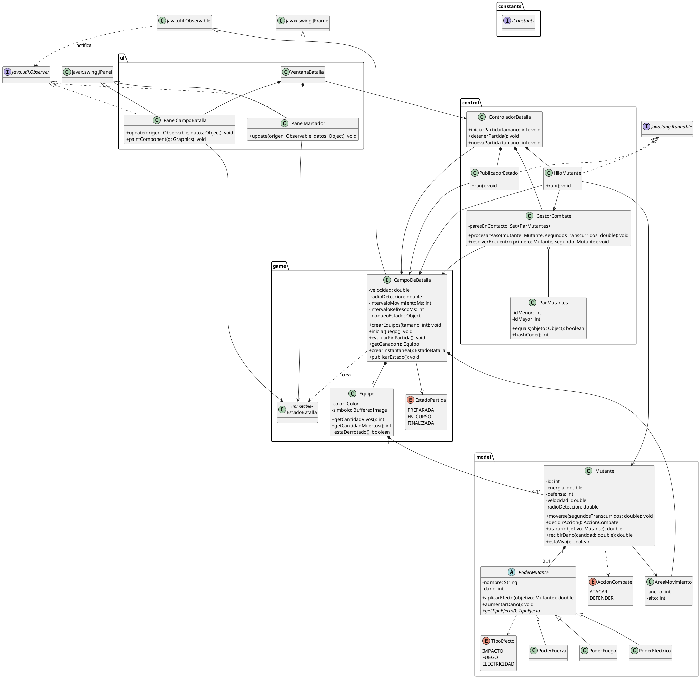

# Juego de Batalla de Mutantes

- **Curso:** Programación Orientada a Objetos.
- **Institución:** Instituto Tecnológico de Costa Rica.
- **Autores:** Elian Montero y Patrick Zúñiga.
- **Entrega final:** viernes 25 de septiembre de 2026.
- **Estado:** especificación de diseño para revisión previa a la programación.

## 1. Descripción general

Juego automático desarrollado en Java. El usuario ingresa únicamente el tamaño de los equipos, entre 3 y 11 mutantes. El sistema crea dos equipos del mismo tamaño con mutantes aleatorios, inicia la batalla y la ejecuta hasta que un equipo pierde a todos sus integrantes. Al finalizar, se puede comenzar otra partida.

El proyecto amplía el ejercicio de la semana 5. Sus clases y poderes existentes deberán contrastarse con esta especificación antes de implementar, pues ese ejercicio no está incluido en este documento.

### Organización por capas

- **Modelo (`model`):** mutantes, poderes, energía, defensa y movimiento individual.
- **Juego (`game`):** campo no visual, equipos, configuración, marcador y estado de la partida.
- **Control (`control`):** ejecución de hilos, detección de encuentros, coordinación del combate y publicación de actualizaciones.
- **Interfaz gráfica (`ui`):** ventanas y paneles Swing que muestran el estado mediante MVC y Observer.
- **Constantes (`constants`):** interfaz compartida `IConstants`; no representa una quinta capa funcional.

## 2. Especificación de clases

Los atributos son privados, excepto las constantes. Se exponen consultas y operaciones necesarias, evitando setters que permitan modificar arbitrariamente energía, daño o equipos. Las colecciones se consultan mediante copias o vistas de solo lectura.

### 2.1. Modelo (`model`)

#### Clase `AreaMovimiento`

- **Responsabilidad:** representar los límites no visuales que recibe cada mutante al construirse.
- **Atributos:**
  - `ancho: int`: ancho positivo del área.
  - `alto: int`: alto positivo del área.
- **Métodos:**
  - `AreaMovimiento(int ancho, int alto)`.
  - `getAncho(): int`.
  - `getAlto(): int`.
- **Reglas:** es inmutable y compartida por los mutantes del campo. Permite que el modelo conozca sus límites sin depender del paquete `game`.

#### Enumeración `AccionCombate`

- **Valores:** `ATACAR` y `DEFENDER`.
- **Responsabilidad:** representar la decisión de un mutante para un encuentro específico.

#### Clase `Mutante`

- **Responsabilidad:** mantener el estado individual y ejecutar movimiento, ataque y recepción de daño.
- **Atributos:**
  - `id: int`: identificador único dentro de la partida.
  - `nombre: String`.
  - `energia: double`: inicia en 100 y nunca baja de 0.
  - `defensa: int`: valor aleatorio entre 1 y 3.
  - `poder: PoderMutante`: como máximo un poder; cada instancia de poder pertenece a un solo mutante.
  - `area: AreaMovimiento`: recibida en el constructor.
  - `posicionX, posicionY: double`: coordenadas actuales.
  - `direccionX, direccionY: double`: dirección de desplazamiento.
  - `velocidad: double`: unidades de distancia por segundo.
  - `radioDeteccion: double`: distancia de detección configurada.
- **Métodos principales:**
  - `Mutante(int id, String nombre, int defensa, PoderMutante poder, AreaMovimiento area, double velocidad, double radioDeteccion, double x, double y)`.
  - `moverse(double segundosTranscurridos): void`: avanza dentro del área almacenada; no recibe los límites en cada llamada.
  - `decidirAccion(): AccionCombate`: elige aleatoriamente atacar o defender para el encuentro actual.
  - `atacar(Mutante objetivo): double`: solicita a su poder el daño del ataque; devuelve 0 si no tiene poder.
  - `recibirDano(double cantidad): double`: descuenta energía y devuelve la cantidad realmente perdida.
  - `estaVivo(): boolean`: consulta `energia > 0`; no se guarda un booleano redundante.
- **Reglas:**
  - Un mutante muerto no se mueve, ataca ni participa en nuevos encuentros.
  - El movimiento conserva una dirección durante varios pasos, cambia aleatoriamente y rebota al alcanzar un límite.
  - Para esta partida se genera exactamente un poder ofensivo por mutante; el modelo admite cero o uno.
  - Defender es una decisión local del encuentro, no un estado permanente: un mutante puede decidir distinto ante otro enemigo.

#### Clase abstracta `PoderMutante`

- **Responsabilidad:** representar el poder ofensivo y su progresión.
- **Atributos:**
  - `nombre: String`.
  - `dano: int`: inicia aleatoriamente entre 1 y 3 y aumenta hasta 7.
- **Métodos principales:**
  - `aplicarEfecto(Mutante objetivo): double`: devuelve el daño bruto del ataque; no modifica directamente la energía.
  - `aumentarDano(): void`: incrementa el daño en uno sin superar 7.
  - `getDano(): int`.
  - `getTipoEfecto(): TipoEfecto`: método abstracto que identifica el efecto para su representación.
- **Reglas:**
  - El mutante atacante llama a `poder.aplicarEfecto(objetivo)` desde `atacar`; no se pasa nuevamente como parámetro.
  - Dentro de `Mutante`, `this` es el atacante; dentro de `PoderMutante`, `this` es el poder. No se confunden ambos objetos.
  - El gestor aplica la defensa y descuenta la energía una sola vez.

#### Poderes concretos y `TipoEfecto`

- **Propuesta inicial:** `PoderFuerza`, `PoderFuego` y `PoderElectrico` extienden `PoderMutante`.
- Cada subclase implementa `getTipoEfecto()` con `IMPACTO`, `FUEGO` o `ELECTRICIDAD`, respectivamente.
- Comparten la fórmula de daño exigida; el efecto identifica la representación visual del ataque.
- El mutante usa una referencia `PoderMutante`, independientemente de la subclase concreta.
- Esta propuesta no agrega regeneración, daño adicional ni alteraciones de velocidad. Esos efectos del borrador original cambian las reglas y requieren revisión del profesor.
- Las subclases definitivas y la profundidad del polimorfismo deben validarse contra el ejercicio de la semana 5. La diferencia visual propuesta no equivale a tres algoritmos de combate distintos.

### 2.2. Juego (`game`)

#### Clase `Equipo`

- **Responsabilidad:** agrupar e identificar los mutantes y proporcionar su marcador.
- **Atributos:**
  - `nombre: String`.
  - `color: java.awt.Color`.
  - `simbolo: java.awt.image.BufferedImage`: imagen del escudo.
  - `mutantes: List<Mutante>`.
- **Métodos principales:**
  - `agregarMutante(Mutante mutante): void`: usado durante la creación del equipo.
  - `getCantidadVivos(): int`: cuenta los integrantes con energía positiva.
  - `getCantidadMuertos(): int`: total menos vivos.
  - `estaDerrotado(): boolean`.
  - `getMutantes(): List<Mutante>`: consulta de solo lectura.
- **Reglas:** no se agregan integrantes durante una partida. Los conteos se derivan del estado de los mutantes para evitar un marcador desactualizado.

#### Enumeración `EstadoPartida`

- **Valores:** `PREPARADA`, `EN_CURSO`, `FINALIZADA`.

#### Clase `CampoDeBatalla` — extiende `java.util.Observable`

- **Responsabilidad:** mantener el estado completo y no visual de la partida.
- **Atributos:**
  - `area: AreaMovimiento`.
  - `equipoA, equipoB: Equipo`.
  - `velocidad: double`: velocidad inicial de los mutantes.
  - `radioDeteccion: double`: radio común de los encuentros.
  - `intervaloMovimientoMs: int`.
  - `intervaloRefrescoMs: int`: frecuencia de publicación para la UI.
  - `estado: EstadoPartida`.
  - `ganador: Equipo`: ausente mientras no haya un vencedor.
  - `bloqueoEstado: Object`: monitor compartido para operaciones consistentes.
- **Métodos principales:**
  - `crearEquipos(int tamano): void`: valida el tamaño y genera ambos equipos con energía, defensa y daño iniciales según las reglas.
  - `iniciarJuego(): void`: pasa de preparada a en curso; el controlador arranca los hilos.
  - `evaluarFinPartida(): void`: comprueba derrotas y actualiza el resultado.
  - `hayGanador(): boolean`.
  - `getGanador(): Equipo`.
  - `crearInstantanea(): EstadoBatalla`: obtiene una copia inmutable y consistente del estado.
  - `publicarEstado(): void`: crea la instantánea, llama `setChanged()` y luego `notifyObservers(instantanea)`.
- **Reglas:**
  - Proporciona el área a cada mutante en su construcción.
  - La configuración se define antes de iniciar; el usuario solo ingresa el tamaño del equipo.
  - No dibuja, manipula componentes Swing ni crea hilos.
  - La notificación ocurre fuera del bloqueo del estado para no retenerlo mientras se ejecutan observadores.

#### Clase `EstadoBatalla`

- **Responsabilidad:** transportar una instantánea inmutable para dibujar sin leer objetos que estén cambiando.
- **Datos:** estado de partida, dimensiones, datos de equipos, posiciones, energía, estado de vida, efectos de ataques, conteos y resultado.
- **Reglas:** contiene copias de los datos necesarios; no expone mutantes modificables. Sus datos auxiliares también son inmutables.

### 2.3. Control (`control`)

#### Clase `ControladorBatalla`

- **Responsabilidad:** conectar las solicitudes de la ventana con el ciclo de vida del juego.
- **Atributos:**
  - `campo: CampoDeBatalla`.
  - `gestorCombate: GestorCombate`.
  - `hilosMutantes: List<Thread>`.
  - `hiloPublicador: Thread`.
- **Métodos principales:**
  - `iniciarPartida(int tamano): void`: prepara el campo y los observadores, inicia el juego y arranca los trabajadores.
  - `detenerPartida(): void`: solicita la detención, interrumpe las esperas y libera los trabajadores.
  - `nuevaPartida(int tamano): void`: espera la terminación de la anterior y crea una partida limpia.
- **Reglas:** la espera de terminación con `join()` se realiza fuera del hilo de eventos de Swing. No reutiliza hilos terminados ni deja trabajadores de una partida anterior activos.

#### Clase `HiloMutante` — implementa `Runnable`

- **Responsabilidad:** solicitar periódicamente un paso de movimiento y detección para un mutante.
- **Atributos:**
  - `mutante: Mutante`.
  - `campo: CampoDeBatalla`.
  - `gestorCombate: GestorCombate`.
- **Métodos principales:**
  - `run(): void`: repite pasos hasta la muerte, el fin de partida o una interrupción.
- **Reglas:** mide el tiempo transcurrido, llama al gestor y espera el intervalo configurado. No mantiene bloqueos durante la espera. Al recibir `InterruptedException`, restaura la interrupción y termina.

#### Clase `GestorCombate`

- **Responsabilidad:** coordinar movimiento, entradas al radio y resolución consistente de encuentros.
- **Atributos:**
  - `campo: CampoDeBatalla`.
  - `paresEnContacto: Set<ParMutantes>`: pares enemigos que ya están dentro del radio.
- **Métodos principales:**
  - `procesarPaso(Mutante mutante, double segundosTranscurridos): void`: mueve, revisa contactos y resuelve nuevas entradas bajo el monitor del campo.
  - `detectarEnemigosEnRadio(Mutante mutante): List<Mutante>`.
  - `resolverEncuentro(Mutante primero, Mutante segundo): void`: obtiene las dos decisiones y aplica las reglas.
- **Reglas:**
  - Revisa que la partida siga activa y los participantes estén vivos.
  - Movimiento, consulta de posiciones, registro del par, energía y progresión del poder se coordinan con el mismo monitor.
  - Actualiza el fin de partida después de cada encuentro.
  - No notifica observadores mientras mantiene el bloqueo.

#### Clase `ParMutantes`

- **Responsabilidad:** identificar un encuentro sin depender del orden de detección.
- **Atributos:** `idMenor: int`, `idMayor: int`, inmutables.
- **Métodos:** constructor que ordena los identificadores, `equals(Object)` y `hashCode()`.
- **Regla:** `(A, B)` y `(B, A)` representan el mismo par.

#### Clase `PublicadorEstado` — implementa `Runnable`

- **Responsabilidad:** publicar instantáneas a la frecuencia de refresco configurada, independientemente del movimiento.
- **Atributo:** `campo: CampoDeBatalla`.
- **Método:** `run(): void`.
- **Reglas:** publica periódicamente, publica el estado final y termina. Las esperas se interrumpen al cerrar o reiniciar.

### 2.4. Interfaz gráfica (`ui`)

#### Clase `VentanaBatalla` — extiende `JFrame`

- **Responsabilidad:** solicitar el tamaño inicial, contener los paneles y ofrecer una nueva partida al finalizar.
- **Atributos:** `controlador: ControladorBatalla`, `panelCampo: PanelCampoBatalla`, `panelMarcador: PanelMarcador`.
- **Reglas:** delega iniciar, reiniciar y cerrar al controlador. No calcula movimiento, daño ni ganadores.

#### Clase `PanelCampoBatalla` — extiende `JPanel`, implementa `java.util.Observer`

- **Responsabilidad:** dibujar posiciones, equipos, escudos, energía y estados de vida.
- **Atributo:** `estado: EstadoBatalla`, última instantánea recibida.
- **Métodos:**
  - `update(Observable origen, Object datos): void`: agenda la actualización del panel con `SwingUtilities.invokeLater(...)`.
  - `paintComponent(Graphics g): void`: dibuja la instantánea.
- **Reglas:** los muertos se distinguen visualmente y permanecen inmóviles. Todos los mutantes vivos se muestran simultáneamente.

#### Clase `PanelMarcador` — extiende `JPanel`, implementa `java.util.Observer`

- **Responsabilidad:** mostrar energía individual, vivos y muertos por equipo, estado de partida y resultado.
- **Atributo:** `estado: EstadoBatalla`.
- **Método:** `update(Observable origen, Object datos): void`, que agenda el cambio visual en el hilo de eventos de Swing.

Se utilizan `java.util.Observable` y `java.util.Observer`, conforme a la indicación del profesor. Se elimina la interfaz propia `ObservadorBatalla` del borrador.

### 2.5. Constantes (`constants`)

#### Interfaz `IConstants`

- **Responsabilidad:** reunir los valores fijos; se consultan como `IConstants.ENERGIA_INICIAL`, sin implementar la interfaz en todas las clases.
- Todos los atributos se declaran explícitamente `public final static`.
- **Constantes definidas por el enunciado:**
  - `double ENERGIA_INICIAL = 100.0`.
  - `int DEFENSA_MIN = 1`, `DEFENSA_MAX = 3`.
  - `int DANO_INICIAL_MIN = 1`, `DANO_INICIAL_MAX = 3`.
  - `int DANO_MAX_PODER = 7`, `INCREMENTO_DANO = 1`.
  - `int TAMANO_EQUIPO_MIN = 3`, `TAMANO_EQUIPO_MAX = 11`.
- **Valores iniciales propuestos, ajustables antes de iniciar:**
  - `int ANCHO_CAMPO = 1000`, `ALTO_CAMPO = 600`.
  - `double VELOCIDAD_DEFAULT = 60.0`: unidades por segundo.
  - `double RADIO_DETECCION_DEFAULT = 40.0`.
  - `int INTERVALO_MOVIMIENTO_MS = 20`.
  - `int REFRESH_RATE_MS = 33`.
  - `double PROPORCION_ZONA_BASE = 0.2`.
  - `double PROBABILIDAD_ATACAR = 0.5`.
- También se centralizan colores `Color`, rutas de imágenes, parámetros del cambio de dirección y dimensiones de dibujo cuando se implementen.

## 3. Reglas de combate

1. Cada mutante inicia con 100 de energía, defensa aleatoria entre 1 y 3 y un poder con daño inicial entre 1 y 3.
2. Dos enemigos están en contacto cuando su distancia es menor o igual al radio configurado. Se puede comparar la distancia al cuadrado con el radio al cuadrado.
3. Al entrar en contacto, ambos eligen su acción una sola vez para ese encuentro.
4. Si ambos defienden, ninguno pierde energía.
5. Si uno ataca y el otro defiende, el daño recibido es `danoPoder / (double) defensaObjetivo`.
6. Si ambos atacan, cada uno recibe el daño completo del poder contrario. Se calculan ambos daños con el estado inicial del encuentro y luego se aplican, para evitar favorecer al primero por el orden del código.
7. Por cada ataque que efectivamente reduzca energía, el poder del atacante aumenta en 1, hasta 7. El incremento se aplica después de calcular los daños del encuentro.
8. La energía se limita a 0 como mínimo. Se almacena como `double` para conservar daños como `1 / 3`.
9. Un par no vuelve a combatir mientras permanezca en contacto. Al separarse se elimina del registro; una nueva entrada permite otro encuentro.
10. Si hay varios enemigos próximos, se procesa una acción por cada par nuevo, comprobando nuevamente si los involucrados siguen vivos.
11. Al quedar un equipo sin vivos, gana el contrario. Si el último ataque simultáneo elimina a ambos equipos, se registra empate como decisión propuesta pendiente de revisión.

## 4. Concurrencia y MVC

### Enfoque seleccionado: un hilo por mutante

- Se crean entre 6 y 22 hilos de mutantes, además del publicador y el hilo de eventos de Swing.
- Cada trabajador tiene su propio ciclo, pero las modificaciones al estado compartido se realizan dentro de `synchronized (bloqueoEstado)`.
- La inserción y consulta de `paresEnContacto` se hacen en la misma sección crítica. Si ambos hilos detectan el mismo par, solo el primero lo registra y resuelve.
- Las lecturas para decidir si un trabajador continúa también usan el monitor; no se consultan campos compartidos sin sincronización.
- Crear una instantánea usa el monitor. Notificar observadores, dormir y esperar otros hilos ocurre fuera de él.
- Los hilos terminan cuando su mutante muere, finaliza la partida o se solicita una interrupción.

Este diseño permite ciclos concurrentes de mutantes, pero serializa los pasos que modifican el estado. Es una elección inicial sencilla de explicar para un máximo de 22 mutantes. **Debe validarse con el profesor si esta coordinación satisface su requisito de paralelismo:** no ejecuta dos resoluciones de combate simultáneamente. Si exige eso, habrá que diseñar bloqueos por mutante y coordinación adicional para los contactos y el fin de partida antes de programar.

### Distribución MVC y Observer

- **Modelo de MVC:** paquetes `model` y `game`.
- **Vista:** `VentanaBatalla`, `PanelCampoBatalla` y `PanelMarcador`.
- **Controlador:** `ControladorBatalla` y sus trabajadores de `control`.
- **Observable:** `CampoDeBatalla`.
- **Observadores:** los dos paneles, mediante el Observer de Java.
- **Flujo:** solicitud de inicio → controlador → campo y trabajadores → instantánea publicada → observadores → actualización visual en Swing.

## 5. Diagrama UML (PlantUML)

El diagrama resume las clases principales. Los tipos auxiliares de instantáneas y los programas de prueba se describen en las specs para mantenerlo legible.

## 6. Verificación prevista por capa

- **`model.MainModelo`:** comprobar energía inicial, límites del movimiento, daño fraccionario, muerte y tope de poder.
- **`game.MainJuego`:** crear equipos de 3 y 11, rechazar tamaños inválidos, comprobar conteos y resultado sin interfaz gráfica.
- **`control.MainControl`:** ejecutar una batalla en consola y comprobar detección duplicada, salida y reentrada al radio, muerte durante encuentros múltiples y terminación de trabajadores.
- **`ui.MainUI`:** mostrar instantáneas de ejemplo para verificar equipos, escudos, energía y marcador sin calcular combates.
- **`app.Main`:** ejecutar la aplicación completa y verificar inicio, fin, cierre y nueva partida sin hilos anteriores activos.

Las verificaciones de encuentros usarán posiciones, decisiones y daños controlados para reproducir los casos de atacar/atacar, atacar/defender y defender/defender.

## 7. Orden de trabajo

1. Revisar esta especificación entre ambos integrantes y subirla al repositorio para revisión del profesor.
2. Incorporar las correcciones y mantener el UML consistente con las specs.
3. Generar los esqueletos de clases organizados por paquetes.
4. Implementar y verificar cada capa con su propio `main`.
5. Integrar la aplicación mediante `app.Main`.
6. Registrar contribuciones de ambos integrantes en GitHub y preparar la explicación del diseño, los algoritmos y el código.

Este README describe el diseño propuesto; no afirma que el juego ni sus verificaciones estén implementados.
