# Week 9 – Problema 4: Banking multi-identidad con herencia y polimorfismo

## 1. Problema del diseño original

- **Un `switch` por dimensión** en `BankingService`: identidades (`isOperationAllowed`, `checkIdentityRules`, `dailyLimit`, `isProcessorAllowed`) y procesadores (`processorSupports`, `calculateFee`, `dispatch`). Agregar un tipo obliga a editar varios métodos.
- **`Identity` y `BankOperation` son "varias clases en una"**: campos `null` según el tipo y estados inválidos posibles.
- **Tres estilos de error** de los procesadores (`null`, prefijo `REJECTED:`, excepción) y la conversión a centavos de Pacific viven en el servicio.
- **`BankingService` tiene demasiadas responsabilidades**: permisos, reglas, límites, comisiones, ruteo, traducción de APIs y auditoría.

## 2. Solución

- **`Identity` pasa a ser una jerarquía.** Cada subclase define sus operaciones permitidas, su límite diario, sus validaciones y sus procesadores permitidos.
- **`BankOperation` pasa a ser una jerarquía.** Cada operación tiene solo sus datos, por ejemplop: el payroll tiene beneficiarios, la transferencia internacional tiene BIC, y calcula su propio total.
- **Los procesadores se envuelven con Adapters** (composición) que implementan una interfaz única, `BankProcessor`. Las clases bancarias originales **no se modifican**.
- **`BankingService` solo orquesta** llamando a métodos polimórficos, sin `switch` por tipo.

## 3. Diagrama

```mermaid
classDiagram
    direction TB

    %% ---------- IDENTIDADES ----------
    class Identity {
        <<abstract>>
        -String accountNumber
        +getType()* IdentityType
        +canPerform(OperationType)* boolean
        +dailyLimit()* double
        +validate(BankOperation, LocalDate)* Optional~String~
        +allowedProcessors() Set~ProcessorCode~
    }
    class PersonalIdentity
    class BusinessIdentity {
        -String companyName
    }
    class MinorIdentity {
        -String guardianUserId
        +allowedProcessors() Set~ProcessorCode~
    }
    class ForeignResidentIdentity {
        -String countryCode
        -LocalDate residencyExpiresOn
    }
    Identity <|-- PersonalIdentity
    Identity <|-- BusinessIdentity
    Identity <|-- MinorIdentity
    Identity <|-- ForeignResidentIdentity

    %% ---------- OPERACIONES ----------
    class BankOperation {
        <<abstract>>
        -double amount
        -String currency
        -String approvalCode
        +getType()* OperationType
        +totalAmount() double
        +countsAgainstDailyLimit() boolean
        +accept(OperationVisitor~R~, Identity)* R
    }
    class DepositOperation
    class WithdrawalOperation
    class DomesticTransferOperation {
        -String destinationAccount
    }
    class InternationalTransferOperation {
        -String destinationAccount
        -String destinationBic
    }
    class PayrollOperation {
        -List~String~ payeeAccounts
        +totalAmount() double
    }
    BankOperation <|-- DepositOperation
    BankOperation <|-- WithdrawalOperation
    BankOperation <|-- DomesticTransferOperation
    BankOperation <|-- InternationalTransferOperation
    BankOperation <|-- PayrollOperation

    class OperationVisitor~R~ {
        <<interface>>
        +visit(DepositOperation, Identity) R
        +visit(WithdrawalOperation, Identity) R
        +visit(DomesticTransferOperation, Identity) R
        +visit(InternationalTransferOperation, Identity) R
        +visit(PayrollOperation, Identity) R
    }
    BankOperation ..> OperationVisitor : accept()

    %% ---------- INTERFAZ UNIFICADA + ADAPTERS ----------
    class BankProcessor {
        <<interface>>
        +code() ProcessorCode
        +supports(OperationType) boolean
        +fee(BankOperation) double
        +process(Identity, BankOperation) ProcessorResult
    }
    class ProcessorAdapter {
        <<abstract>>
        +process(Identity, BankOperation) ProcessorResult
        #normalize(String) ProcessorResult
    }
    class NationalBankAdapter
    class PacificBankAdapter
    class SwiftGatewayAdapter
    BankProcessor <|.. ProcessorAdapter
    OperationVisitor <|.. ProcessorAdapter
    ProcessorAdapter <|-- NationalBankAdapter
    ProcessorAdapter <|-- PacificBankAdapter
    ProcessorAdapter <|-- SwiftGatewayAdapter

    %% ---------- APIs EXTERNAS (NO SE MODIFICAN) ----------
    class NationalBankProcessor {
        <<externo>>
        +postTransaction(String, String, double, String) String
    }
    class PacificBankProcessor {
        <<externo>>
        +submit(String, String, long, String) String
        +submitPayroll(String, List~String~, long) String
    }
    class SwiftGatewayProcessor {
        <<externo>>
        +sendWire(String, String, String, double, String) String
    }
    NationalBankAdapter o-- NationalBankProcessor : wraps
    PacificBankAdapter o-- PacificBankProcessor : wraps
    SwiftGatewayAdapter o-- SwiftGatewayProcessor : wraps

    note for NationalBankAdapter "process() ==> postTransaction(acct, tipo, total, destino)\nretorna null si falla"
    note for PacificBankAdapter "process() ==> submit(acct, TRF, centavos, destino)\no submitPayroll(acct, payees, centavos)\nretorna REJECTED:motivo si falla"
    note for SwiftGatewayAdapter "process() ==> sendWire(acct, destino, bic, total, moneda)\nlanza IllegalArgumentException si falla"
    note for ProcessorAdapter "normalize() convierte los 3 estilos de error\n(null / REJECTED: / excepcion) en ProcessorResult"

    %% ---------- ORQUESTADOR ----------
    class BankingService {
        +execute(User, IdentityType, BankOperation, ProcessorCode, LocalDate) OperationResult
    }
    class ProcessorRegistry {
        +get(ProcessorCode) BankProcessor
    }
    BankingService ..> Identity : polimorfismo
    BankingService ..> BankOperation : polimorfismo
    BankingService ..> BankProcessor : polimorfismo
    BankingService --> ProcessorRegistry
    ProcessorRegistry o-- "3" BankProcessor
```



Cómo leer el diagrama: `BankingService` solo conoce `BankProcessor.process(...)`. Hacia abajo, cada adapter traduce esa llamada única al método propio de su banco (ver notas), y el banco original queda intacto.

## 4. Polimorfismo

En `BankingService.execute(...)` las variables son del tipo base. Cada llamada se resuelve en tiempo de ejecución según la subclase real:

```java
identity.canPerform(operation.getType())            // Personal, Business, Minor o ForeignResident
identity.validate(operation, today)                 // cada identidad aplica sus propias reglas
identity.dailyLimit()                               // 2,000 / 50,000 / 100 / 5,000
identity.allowedProcessors().contains(code)         // Minor devuelve solo NATIONAL
operation.totalAmount()                             // Payroll multiplica por beneficiarios
operation.countsAgainstDailyLimit()                 // Deposit devuelve false
processor.fee(operation)                            // cada adapter calcula su comisión
processor.process(identity, operation)              // cada adapter llama a su banco
```

Ejemplo de una sobreescritura, la regla vive en la clase que le corresponde, no en un `switch`:

```java
// BusinessIdentity
@Override public double dailyLimit() { return 50_000; }

// MinorIdentity
@Override public double dailyLimit() { return 100; }
@Override public Set<ProcessorCode> allowedProcessors() { return EnumSet.of(ProcessorCode.NATIONAL); }

// PayrollOperation
@Override public double totalAmount() { return getAmount() * payeeAccounts.size(); }
```

Agregar una identidad nueva (p. ej. `SeniorIdentity`) o un procesador nuevo (p. ej. `CryptoAdapter`) es crear una clase; `BankingService` no cambia.

## 5. Wrapping de los procesadores sin alterarlos

Contrato unificado:

```java
public interface BankProcessor {
    ProcessorCode code();
    boolean supports(OperationType type);
    double fee(BankOperation op);
    ProcessorResult process(Identity payer, BankOperation op);
}
```

La clase base unifica los tres estilos de error en un solo lugar:

```java
// ProcessorAdapter
public final ProcessorResult process(Identity payer, BankOperation op) {
    try { return normalize(op.accept(this, payer)); }          // double dispatch al visit() correcto
    catch (IllegalArgumentException e) { return ProcessorResult.rejected(code() + " error: " + e.getMessage()); } // Swift
}
protected ProcessorResult normalize(String raw) {
    if (raw == null) return ProcessorResult.rejected(code() + " rejected the operation");           // National
    if (raw.startsWith("REJECTED:")) return ProcessorResult.rejected(raw.substring(9));             // Pacific
    return ProcessorResult.accepted(raw);
}
```

Cada adapter llama al método **original** de su banco, tal como viene, y se encarga de las diferencias (nombres, unidades, argumentos):

```java
// NationalBankAdapter
public String visit(WithdrawalOperation op, Identity p) {
    return legacy.postTransaction(p.getAccountNumber(), "WITHDRAWAL", op.totalAmount(), null);
}

// PacificBankAdapter  (la conversión a centavos es un detalle de Pacific, vive aquí)
public String visit(DomesticTransferOperation op, Identity p) {
    return legacy.submit(p.getAccountNumber(), "TRF", Math.round(op.totalAmount() * 100), op.getDestinationAccount());
}
public String visit(PayrollOperation op, Identity p) {
    return legacy.submitPayroll(p.getAccountNumber(), op.getPayeeAccounts(), Math.round(op.getAmount() * 100));
}

// SwiftGatewayAdapter
public String visit(InternationalTransferOperation op, Identity p) {
    return legacy.sendWire(p.getAccountNumber(), op.getDestinationAccount(), op.getDestinationBic(),
                           op.totalAmount(), op.getCurrency());
}
```

Cada operación sabe a qué `visit` llamar, trabajando una línea por clase:

```java
@Override public <R> R accept(OperationVisitor<R> v, Identity payer) { return v.visit(this, payer); }
```

## 6. Qué mejora

- **Sin `switch` por tipo** en `BankingService`: reglas, límites y comisiones viven en su propia clase.
- **Estados inválidos imposibles:** los datos obligatorios se piden en el constructor (un `ForeignResidentIdentity` siempre tiene fecha de residencia; una transferencia internacional siempre tiene BIC).
- **Un solo lugar para los errores y las unidades de cada banco:** su adapter.
- **Abierto a extensión, cerrado a modificación:** nuevas identidades, operaciones o procesadores se agregan sin tocar el servicio.

## 7. Un ejemplo completo: Ana retira 500
1. `BankingService` recibe la operación y busca la identidad personal de Ana.
2. Pregunta `identity.canPerform(...)`. La identidad personal responde que sí.
3. Pregunta `identity.validate(...)`. No hay problemas.
4. Pregunta `operation.totalAmount()`. Son 500.
5. Pregunta `identity.dailyLimit()`. El límite es 2,000, así que pasa.
6. Elige el procesador y pregunta `processor.fee(op)`. National cobra 0.
7. Llama a `processor.process(...)`. El adapter de National llama al método original postTransaction(...) y devuelve el resultado.
8. El servicio registra en la auditoría y devuelve el resultado.

En ningún paso el servicio preguntó de qué tipo era cada quién.