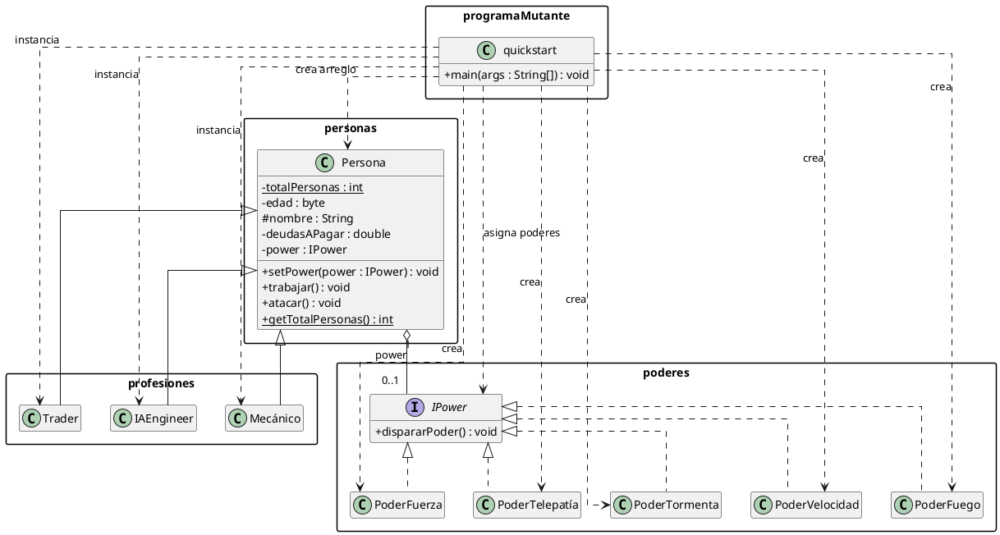

# Programa Mutante

Programa pequeño de Java que demuestra los fundamentos de la programación orientada a objetos:

- Herencia entre `Persona` y diferentes profesiones.
- Polimorfismo para ejecutar comportamientos profesionales y poderes.
- Encapsulamiento con atributos `private`, `protected`, métodos públicos y un contador estático.
- Organización por paquetes.
- Asociación entre una persona y un poder mutante.

## Como ejecutar

Abre una terminal de PowerShell en la carpeta `EJERCICIOS` y ejecuta:

```powershell
chcp 65001
[Console]::OutputEncoding = [System.Text.UTF8Encoding]::new()
$OutputEncoding = [System.Text.UTF8Encoding]::new()

javac -encoding UTF-8 -d build (Get-ChildItem -Recurse src -Filter *.java).FullName
java '-Dfile.encoding=UTF-8' -cp build programaMutante.quickstart
```

El programa crea diez personas, garantiza la presencia de las tres profesiones y asigna los cinco poderes en las primeras cinco posiciones. Las demás combinaciones son aleatorias. Después, cada persona ejecuta `trabajar()` y `atacar()`.

## Organización de los paquetes

```text
src/
├── Personas/
│   └── Persona.java              # Clase base
├── Profesiones/
│   ├── IAEngineer.java           # Profesión derivada
│   ├── Mecánico.java             # Profesión derivada
│   └── Trader.java               # Profesión derivada
├── Poderes/
│   ├── IPower.java               # Interfaz común de los poderes
│   ├── PoderFuego.java
│   ├── PoderFuerza.java
│   ├── PoderTelepatia.java
│   ├── PoderTormenta.java
│   └── PoderVelocidad.java
└── ProgramaMutante/
    └── quickstart.java           # Punto de entrada
```

Los nombres reales de algunas clases contienen tildes, como `Mecánico` y `PoderTelepatía`.

## Clases principales

### `personas.Persona`

Clase base para todas las personas. Mantiene el nombre, la edad, la deuda y el poder asignado. También proporciona:

- getters y setters para los datos públicos de la clase;
- `trabajar()`, que puede sobrescribirse en las profesiones;
- `setPower()` y `atacar()`, utilizados para el polimorfismo de los poderes;
- `totalPersonas`, un contador estático compartido por todas las instancias.

### `profesiones.IAEngineer`

Hereda de `Persona` y representa a un ingeniero de inteligencia artificial. Sobrescribe `trabajar()` y posee operaciones para diseñar IA, crear aplicaciones y entrenar modelos.

### `profesiones.Mecánico`

Hereda de `Persona` y representa a un mecánico. Sobrescribe `trabajar()` y posee operaciones para reparar y diagnosticar vehículos, además de cobrar reparaciones.

### `profesiones.Trader`

Hereda de `Persona` y representa a un trader. Sobrescribe `trabajar()` y posee operaciones para analizar el mercado, comprar activos y vender activos.

### `poderes.IPower`

Interfaz común con el método `dispararPoder()`. Cada implementación imprime una representación visual diferente:

- `PoderFuego`;
- `PoderFuerza`;
- `PoderTelepatía`;
- `PoderTormenta`;
- `PoderVelocidad`.

### `programaMutante.quickstart`

Contiene el método `main`. Crea un arreglo de referencias `Persona`, instancia diferentes profesiones, asocia poderes e invoca los métodos polimórficos sin depender del tipo concreto del objeto.

## Diagrama de clases

Diagrama en plantUML.


