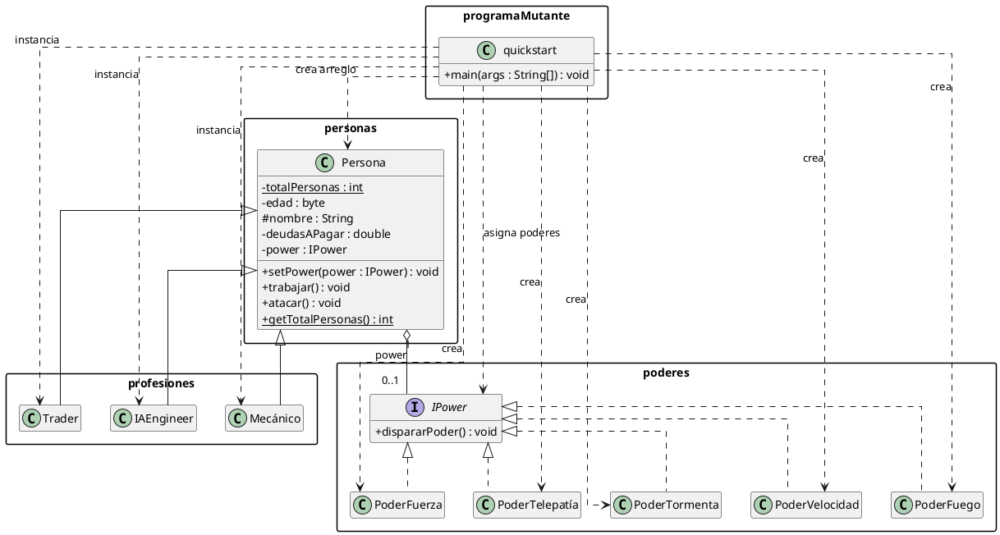

# Programa Mutante

Programa pequeno de Java que demonstra os fundamentos da programacao orientada a objetos:

- heranca entre `Persona` e diferentes profissoes;
- polimorfismo para executar comportamentos profissionais e poderes;
- encapsulamento com atributos `private`, `protected`, metodos publicos e un contador estatico;
- organizacao por pacotes;
- associacao entre uma pessoa e um poder mutante.

## Como executar

Abra uma terminal PowerShell na pasta `EJERCICIOS` e execute:

```powershell
chcp 65001
[Console]::OutputEncoding = [System.Text.UTF8Encoding]::new()
$OutputEncoding = [System.Text.UTF8Encoding]::new()

javac -encoding UTF-8 -d build (Get-ChildItem -Recurse src -Filter *.java).FullName
java '-Dfile.encoding=UTF-8' -cp build programaMutante.quickstart
```

O programa cria dez pessoas, garante a presenca das tres profissoes e atribui os cinco poderes nas primeiras cinco posicoes. As demais combinacoes sao aleatorias. Depois, cada pessoa executa `trabajar()` e `atacar()`.

## Organizacao dos pacotes

```text
src/
├── Personas/
│   └── Persona.java              # Classe base
├── Profesiones/
│   ├── IAEngineer.java           # Profissao derivada
│   ├── Mecanico.java             # Profissao derivada
│   └── Trader.java               # Profissao derivada
├── Poderes/
│   ├── IPower.java               # Interface comum dos poderes
│   ├── PoderFuego.java
│   ├── PoderFuerza.java
│   ├── PoderTelepatia.java
│   ├── PoderTormenta.java
│   └── PoderVelocidad.java
└── ProgramaMutante/
    └── quickstart.java           # Ponto de entrada
```

Os nomes reais de algumas classes possuem acentos, como `Mecánico` e `PoderTelepatía`.

## Classes principais

### `personas.Persona`

Classe base para todas as pessoas. Mantem o nome, idade, divida e poder atribuido. Tambem fornece:

- getters e setters para os dados publicos da classe;
- `trabajar()`, que pode ser sobrescrito pelas profissoes;
- `setPower()` e `atacar()`, usados para o polimorfismo dos poderes;
- `totalPersonas`, um contador estatico compartilhado por todas as instancias.

### `profesiones.IAEngineer`

Herda de `Persona` e representa um engenheiro de inteligencia artificial. Sobrescreve `trabajar()` e possui operacoes para desenhar IA, criar aplicacoes e treinar modelos.

### `profesiones.Mecánico`

Herda de `Persona` e representa um mecanico. Sobrescreve `trabajar()` e possui operacoes para reparar e diagnosticar veiculos e cobrar reparacoes.

### `profesiones.Trader`

Herda de `Persona` e representa um trader. Sobrescreve `trabajar()` e possui operacoes para analisar o mercado, comprar ativos e vender ativos.

### `poderes.IPower`

Interface comum com o metodo `dispararPoder()`. Cada implementacao imprime uma representacao visual diferente:

- `PoderFuego`;
- `PoderFuerza`;
- `PoderTelepatía`;
- `PoderTormenta`;
- `PoderVelocidad`.

### `programaMutante.quickstart`

Contem o metodo `main`. Cria un arreglo de referencias `Persona`, instancia diferentes profissoes, associa poderes e chama os metodos polimorficos sem depender do tipo concreto do objeto.

## Diagrama de classes

O diagrama tambem esta disponivel em [`class-diagram.puml`](class-diagram.puml). Ele pode ser visualizado com a extensao PlantUML do VS Code.


